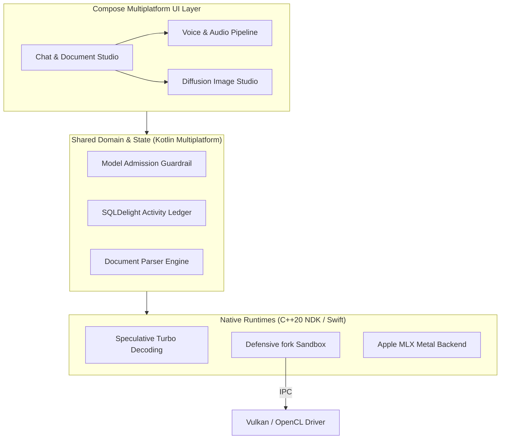

+++
title = "Engineering Projects & Case Studies"
date = "2026-10-21"
description = "In-depth technical case studies and architectural deep dives across Android architecture, Kotlin Multiplatform, on-device AI runtimes, and employer engineering systems."
+++

This page documents selected engineering case studies across **independent products** and **work by employer**. Each case study details the engineering problem, platform constraints, chosen architecture, and technical trade-offs.

---

## 🚀 Independent Products & Case Studies

### 1. AI Playground - On-Device Multimodal AI Workstation

**Summary:** A privacy-first mobile workstation that runs multimodal LLMs and diffusion models locally on phones without cloud dependencies.  
**Role:** Director & Lead Engineer &middot; **Status:** Live on Google Play &middot; iOS in development / planned  
**Stack:** Kotlin Multiplatform (CMP 1.12), Modern C++20 / NDK (JNI), llama.cpp, Google AI Edge LiteRT (v2.3), Apple MLX, Vulkan / OpenCL / Metal, SQLDelight (v2.4)  

#### The Problem
Most AI applications depend entirely on cloud APIs. For users analyzing personal notes, proprietary code, or confidential spreadsheets, sending raw data to remote servers introduces serious privacy concerns, recurring subscription costs, and requires a continuous network connection. I built AI Playground to explore how far consumer phones could be pushed as self-contained, offline-first inference engines.

#### Platform Constraints & Trade-Offs
- **Memory Pressure:** Mobile operating systems terminate processes that spike memory beyond strict system thresholds (Android Low Memory Killer / iOS Jetsam).
- **GPU Driver Fragility:** Vendor Vulkan drivers across heterogeneous Android chipsets frequently encounter segmentation faults during shader compilation.
- **Thermal Ceilings:** Sustained matrix multiplication triggers aggressive kernel thermal downclocking within 60 to 90 seconds if compute pipelines are unthrottled.

#### Architecture Overview

```mermaid
flowchart TD
    subgraph UI ["Compose Multiplatform UI Layer"]
        A[Chat & Document Studio] --> B[Voice & Audio Pipeline]
        A --> C[Diffusion Image Studio]
    end

    subgraph KMP ["Shared Domain & State (Kotlin Multiplatform)"]
        D[Model Admission Guardrail]
        E[SQLDelight Activity Ledger]
        F[Document Parser Engine]
    end

    subgraph Native ["Native Runtimes (C++20 NDK / Swift)"]
        G[Speculative Turbo Decoding]
        H[Defensive fork Sandbox]
        I[Apple MLX Metal Backend]
    end

    UI --> KMP
    KMP --> Native
    H -->|IPC| J[Vulkan / OpenCL Driver]
```

#### Engineering Decisions & Implementation
1. **Dual-Model Speculative Drafting:** Paired lightweight draft models (e.g., Qwen 2.5 0.5B) with larger target models (e.g., Llama 3.2 1B). Dynamic draft context capping (`std::min(2048u, ...)`) and KV cache session pre-warming produced a measured **2x decoding throughput improvement** on local silicon without exhausting VRAM.
2. **Defensive `fork()` Child Process Sandbox:** To prevent vendor GPU driver bugs from crashing the application, native driver probing runs inside an isolated child process with a 3000ms non-blocking watchdog and `kill(pid, SIGKILL)` fallback. If the driver faults, the child process exits cleanly while the host UI remains responsive.
3. **Pure-KMP Document Parsing Engine:** Extracts structured text across 25+ file formats (PDF, DOCX, XLSX, PPTX, CSV, JSON, Markdown, RTF) using pure RFC 1951 Deflate decompression, avoiding third-party native binaries or external web services.
4. **On-Device Diffusion:** Synthesizes 4-step diffusion images on mobile GPUs using Google LiteRT Multi-Graph runtime and Bonsai Image Ternary 4B with thermal throttling checks.
5. **100% Offline Activity Ledger:** Tracks local usage milestones via SQLDelight (schema v10) with strictly zero network calls (`INV-OFFLINE-01`).

#### Links & Artifacts
- **Google Play:** [AI Playground on Google Play](https://play.google.com/store/apps/details?id=com.deardhruv.llmplayground)
- **Technical Series:** [Beyond the Model 6-Part Engineering Series](/posts/ai_playground_series/)

---

### 2. VelociHue - High-Framerate Arcade Game in KMP

**Summary:** A fast-paced arcade action game engineered to prove that Kotlin Multiplatform and Compose Multiplatform can deliver fluid 60–120 FPS gameplay across phones, tablets, and TVs.  
**Role:** Director & Lead Engineer &middot; **Status:** Live on Google Play &middot; iOS in development / planned  
**Stack:** Kotlin Multiplatform (Kotlin 2.4, CMP 1.12), Target SDK 37 (Android 17), Cloud Firestore (Schema v5), Android TV (Leanback & D-pad)  

#### The Problem
Cross-platform toolkits often struggle with consistent high-framerate rendering and low-latency input handling in timing-sensitive games. The objective of VelociHue was to build a commercial arcade title sharing 100% of game physics and progression logic while maintaining native-quality frame pacing across mobile and 10-foot television screens.

#### Architecture & Technical Highlights
1. **Shared Pure-Kotlin Game Engine:** A deterministic physics loop (`GameEngine`, `CollisionDetector`) managing color-matching physics, projectiles, and power-ups across Android, iOS, and Android TV with zero duplicated logic.
2. **Conflict-Free Cloud Sync Engine (Schema v5):** Multi-device synchronization backed by Cloud Firestore with a 3-way union merge strategy that reconciles player progression, cosmetics, and active streaks across devices.
3. **Native Android TV Support:** Dedicated television deployment with Leanback manifest declarations and custom D-pad remote navigation focus states.
4. **Instant Compose Share Cards:** Run-summary share cards captured into high-resolution PNGs via Compose `GraphicsLayer.toImageBitmap()` and shared via Android `FileProvider`.

#### Links & Artifacts
- **Google Play:** [VelociHue on Google Play](https://play.google.com/store/apps/details?id=com.deardhruv.velocihue)

---

## 💼 Selected Work by Employer

### 3. Digital Commerce & In-Store Android Touch Systems

**Summary:** Scalable mobile commerce systems and in-store interactive display software running on custom Android touch hardware.  
**Role:** Lead Android Engineer &middot; **Period:** Feb 2022–Present  
**Stack:** Kotlin, Jetpack Compose, Clean Architecture, MVI, Custom Android OS, Hardware Abstraction Layers  

#### Engineering Scope & Architecture
- **In-Store Touch Hardware:** Conducted research and system architecture for custom Android OS builds powering in-store interactive displays and point-of-sale terminals.
- **Adaptive UI:** Engineered adaptive layouts supporting tablet, foldable, and multi-window configurations using Jetpack Compose Window Size Classes.
- **Offline Catalog Integrity:** Designed a multi-tier caching layer ensuring cart persistence and uninterrupted product browsing during network dropouts.
- **Engineering Quality:** Implemented automated linting, comprehensive code review standards, and library-based modularization.

> **Worked at:** IMPACT Commerce, Denmark &middot; **Role:** Lead Android Engineer &middot; **Period:** Feb 2022–Present

---

### 4. POS & Peripheral Hardware Integration Layer

**Summary:** Resilient Hardware Abstraction Layer (HAL) connecting Android point-of-sale applications to physical retail peripherals.  
**Role:** Lead Android Engineer &middot; **Period:** Feb 2022–Present  
**Stack:** Kotlin, Android NDK, C++, Unix Domain Sockets, Thermal Printers, Payment Terminals HAL  

#### Engineering Scope & Architecture
- **Peripheral Communication:** Engineered asynchronous communication drivers for receipt printers and payment terminals with stateful reconnect logic.
- **Defensive Process Isolation:** Isolated hardware peripheral communication across dedicated process boundaries to prevent peripheral firmware faults or USB disconnects from crashing checkout flows.
- **Background Watchdog:** Implemented automated watchdog services monitoring peripheral connection health and managing graceful offline fallbacks.

> **Worked at:** IMPACT Commerce, Denmark &middot; **Role:** Lead Android Engineer &middot; **Period:** Feb 2022–Present

---

### 5. PLANOLY Visual Planner & StoriesEdit Template Editor

**Summary:** High-performance visual media planning and template editing applications serving millions of global social media creators on Instagram and Pinterest.  
**Role:** Senior Android Developer &middot; **Period:** Nov 2018–Feb 2022  
**Stack:** Kotlin, Java, Jetpack Compose, MVP/MVVM, FFmpeg, Canvas Drawing APIs  

#### Engineering Scope & Architecture
- **Video Manipulation with FFmpeg:** Engineered native video processing pipelines utilizing FFmpeg for transcoding, filtering, and precision video trimming.
- **Photo & Template Editor:** Developed high-fidelity canvas manipulation tools for StoriesEdit, enabling users to compose multi-layer graphic templates for Instagram Stories.
- **Modern Architecture Migration:** Progressively refactored legacy MVP components to modern MVVM using Jetpack libraries and early Jetpack Compose.
- **Performance Profiling:** Diagnosed and resolved memory pressure bottlenecks during high-resolution media export, ensuring smooth rendering across varied Android hardware.

> **Worked at:** PLANOLY, USA &middot; **Role:** Senior Android Developer &middot; **Period:** Nov 2018–Feb 2022

---

### 6. Client Android Applications & Mobile Team Leadership

**Summary:** Enterprise mobile application design, architecture consulting, and engineering team leadership across varied client industries.  
**Role:** Tech Lead | Android Engineer &middot; **Period:** Jun 2016–Oct 2018  
**Stack:** Android SDK, Java, Kotlin, Agile Methodologies, Software Architecture  

#### Engineering Scope & Architecture
- **Team Leadership:** Managed a team of Android developers, overseeing sprint planning, task delegation, and technical delivery.
- **Technical Mentorship:** Organized regular technical workshops introducing modern Android frameworks and reactive programming patterns.
- **Client Collaboration:** Worked directly with enterprise product owners to define architectural requirements, establish delivery timelines, and maintain budget adherence.

> **Worked at:** Ashapura Softech Inc, India &middot; **Role:** Tech Lead / Android Engineer &middot; **Period:** Jun 2016–Oct 2018

---

### 7. Mobile Platform Delivery & UI Automation

**Summary:** Production Android application development and test automation framework architecture.  
**Role:** Team Lead | Senior Android Developer &middot; **Period:** Feb 2014–Jun 2016  
**Stack:** Android SDK, UI Automator, Clean Architecture, JUnit  

#### Engineering Scope & Architecture
- **UI Test Automation:** Built automated UI test suites with Android UI Automator, reducing manual QA regression overhead on key user flows.
- **Team Management:** Led a squad of Android engineers, conducted rigorous code reviews, and enforced maintainability standards.
- **Requirements Engineering:** Translated complex product specifications into modular, scalable mobile codebases.

> **Worked at:** Russmedia Tech, India &middot; **Role:** Team Lead / Senior Android Developer &middot; **Period:** Feb 2014–Jun 2016

---

## 🌐 Open Source & Community Leadership

- **GitHub Ecosystem:** Active contributor and maintainer at [@DearDhruv](https://github.com/DearDhruv).
- **Conference Speaker:** Regular technical speaker at GDG DevFest conferences across India on topics including Jetpack Compose Navigation 3, Android 17 Adaptive Layouts, and on-device AI runtimes.
- **Beyond the Model:** Author of the 6-part engineering series exploring offline-first AI on mobile silicon.
